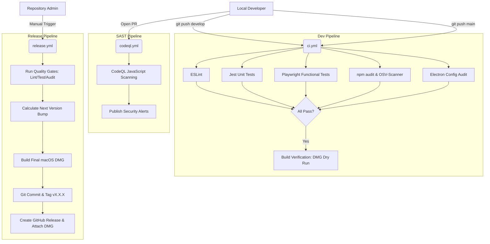

# How ClipVault is Built

This guide explains the exact architecture, dependencies, and build process used to create ClipVault.

---

## 🏗️ 1. The Core Architecture (Electron)

ClipVault is built using **Electron**, a framework that lets you build native desktop applications using web technologies (HTML, CSS, JavaScript). 

Every Electron app has two distinct types of "processes":

### The Main Process (`main.js`)
- **What it is:** The "backend" of the app. It runs in a full Node.js environment.
- **What it does in ClipVault:**
  1. Creates the 📋 tray icon in the macOS menu bar.
  2. Creates the hidden browser window that holds the UI.
  3. Uses `setInterval()` every 800ms to ask macOS for the current clipboard contents (`clipboard.readText()`).
  4. Registers the global keyboard shortcut (`⌘⇧V`).

### The Renderer Process (`app.js`, `index.html`, `index.css`)
- **What it is:** The "frontend" of the app. It's essentially a Chromium web browser window.
- **What it does in ClipVault:**
  1. Displays the Search bar, Tabs, and Clip Cards.
  2. Receives new clipboard text from the Main process.
  3. Saves the clips locally to the browser's `localStorage` (so they survive restarts).

---

## 📦 2. The Packages We Used

If you look at `package.json`, you'll notice all packages are under `devDependencies`. **ClipVault has zero production dependencies.**

| Package / Tool | What we use it for |
|----------------|--------------------|
| **electron** | The core engine (Chromium + Node.js) that runs the app. |
| **electron-builder** | The tool that packages the app into a `.dmg` file for macOS users to download. |
| **eslint** | Checks our code for syntax errors and bad practices. |
| **jest** | Runs our automated Unit Tests. |
| **playwright** | Runs our automated Functional Tests (literally clicks around the app like a user). |

*(Note: When `electron-builder` creates the `.dmg`, it strips out the entire `node_modules` folder, which is why the `node_modules` is huge locally but the final app is heavily optimized).*

---

## 🛠️ 3. How the Clipboard Works

macOS does not have a "clipboard changed" event. To build a clipboard manager, we have to poll the system.

1. In `main.js`, we run `setInterval` every 800ms.
2. We check `clipboard.readText()`.
3. If the text is different from what we checked 800ms ago, we know the user copied something new!
4. We send that new text to the Renderer UI using **IPC** (Inter-Process Communication).

---

## 🔒 4. Data Storage and Privacy

ClipVault does **not** use a database (like SQLite or MongoDB). Instead, it uses **localStorage**.

- **Why?** It's built directly into the Chromium browser window, it's lightning fast, and requires zero setup.
- **The specific keys used are:**
  - `clipvault_clips` (stores the array of your clips)
  - `clipvault_settings` (stores your preferences, like the 100 clip limit)
- **Privacy:** Because it's `localStorage`, the data never leaves your Mac. It is physically impossible for ClipVault to send your data to a server because we don't even include the code to do so.

---

## 🚀 5. The Build Process

When we run `npm run dist:mac`, here is what happens:

1. `electron-builder` takes control.
2. It bundles `main.js`, `app.js`, `index.html`, and `index.css` into a hidden `.asar` file (an archive format used by Electron).
3. It packages that `.asar` file alongside the pre-compiled Electron binary.
4. It attaches our `tray-icon.png` and app metadata.
5. It wraps everything into `ClipVault.app` and compresses it into `ClipVault-0.0.1-arm64.dmg` ready for distribution.

---

## 🤖 6. Continuous Integration & Deployment (CI/CD)

ClipVault uses **GitHub Actions** to automate testing, security scanning, and releases. There are three main workflows.

### 1. The Dev Pipeline (`ci.yml`)
Runs automatically on every push to `develop` or `main` and on Pull Requests. It ensures no broken code gets merged.
- **Linting (`eslint`)**: Checks code style and syntax.
- **Unit Tests (`jest`)**: Runs 40+ isolated tests against the `ClipboardManager` and utility logic.
- **Functional Tests (`playwright`)**: Launches the actual Electron app headlessly on a macOS runner and simulates real user clicks to verify the UI.
- **Security Scans**:
  - `npm audit` (Checks for vulnerable dependencies)
  - `OSV-Scanner` (Checks the Google Open Source Vulnerability database)
  - **Electron Audit** (A custom script we built to verify secure Electron configuration like `nodeIntegration` safeguards).
- **Build Verification**: Does a dry-run build of the `.dmg` to ensure the app compiles properly before merging.

### 2. The CodeQL Pipeline (`codeql.yml`)
Runs automatically on Pull Requests and on a weekly schedule.
- Uses GitHub's advanced **Static Application Security Testing (SAST)** to scan our JavaScript code for injection flaws, insecure data handling, and syntax issues.

### 3. The Release Pipeline (`release.yml`)
Runs **manually** when you are ready to publish a new version.
1. Automatically calculates the next patch version number (e.g., `v0.0.1` → `v0.0.2`).
2. Updates `package.json` with the new version.
3. Runs the full test & security suite one last time.
4. Builds the final `ClipVault-x.x.x-arm64.dmg` file.
5. Commits the version bump back to the repository and creates a git tag.
6. Automatically creates a **GitHub Release** and attaches the compiled `.dmg` file for users to download.
